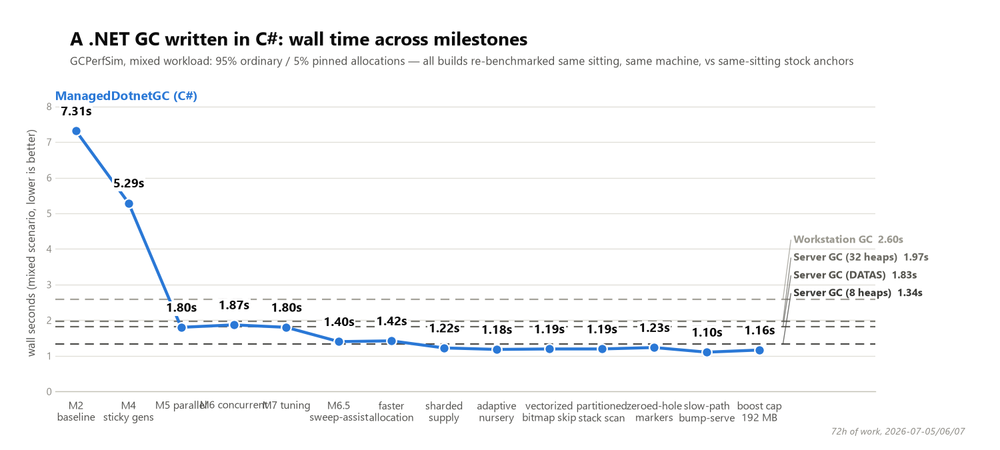
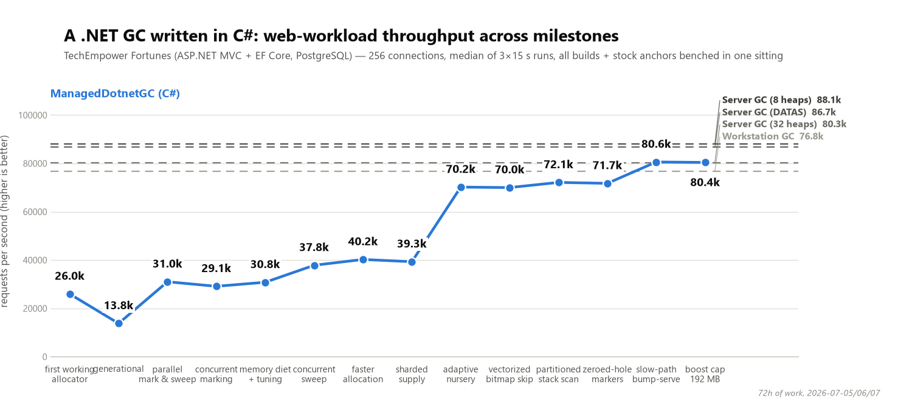
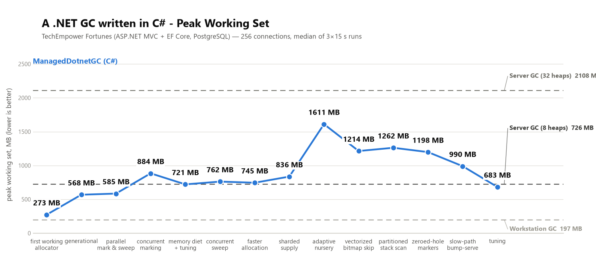

# ManagedDotnetGC

A fully featured .NET garbage collector, written entirely in C#, that plugs into the runtime as a [standalone GC](https://github.com/dotnet/runtime/blob/main/docs/design/features/standalone-gc-loading.md) — no runtime fork, just `DOTNET_GCName` pointing at the DLL.

The project started as an educational skeleton, documented in a [series of blog posts](https://minidump.net/tags/garbage-collection/) (that version lives on the `master` branch). This branch, `claude/experiments`, is a different experiment: letting an AI agent (Claude) evolve that skeleton into a GC that genuinely competes with the one shipped in .NET — designing, benchmarking, and iterating on its own, milestone by milestone. Everything here — code, benchmarks, experiment write-ups — is AI-written.

Current scope: Windows x64, .NET 10, NativeAOT-compiled. The GC itself is garbage-collected-language code managing memory for other garbage-collected-language code, which is exactly as fun as it sounds.

## Results

Two benchmarks, tracked milestone by milestone against the stock .NET GC. The dashed lines are the built-in GC's configurations: Workstation, default Server, and Server tuned to 8 heaps.

**GCPerfSim** (the .NET team's own GC stress tool, a mixed workload with 95% ordinary / 5% pinned allocations — total wall time, lower is better):

From 7.3 s at the first working version down to ~1.1 s — past every stock configuration, including the tuned one.

**TechEmpower Fortunes** (a realistic web workload: ASP.NET MVC + EF Core + PostgreSQL, requests per second, higher is better):

80.4k req/s — ahead of Workstation (76.8k) and default Server (80.3k), within ~9% of the tuned 8-heap Server GC (88.1k) — while using **less memory than any Server configuration** (683 MB peak vs 726 MB for the tuned config).

Each point on these charts has a detailed write-up in [`experiments/results/`](experiments/results/), including the regressions and the ideas that died on measurement.

## How it works

The design makes one big bet that's the opposite of the stock GC's: **objects never move**. The stock GC compacts memory by copying live objects around, which is powerful but expensive and complicated (every pointer to a moved object must be fixed up, pinned objects get in the way). This GC instead leans on a memory layout that makes *not* moving cheap.

**Regions.** At startup the GC reserves one large block of address space and carves it into 2 MB regions. Because everything lives inside that one block, finding which region an object belongs to is a single subtraction and shift — no lookup tables, no searching. Regions are the unit of everything: allocation, reclamation, and returning memory to the OS.

**Allocation is a pointer bump.** Each thread gets a private chunk of a region and allocates by just advancing a pointer — the same trick that makes the stock GC's allocator fast. Memory is zeroed ahead of time by a background thread using non-temporal SIMD stores, so the hot path rarely pays for it. Threads never fight over a lock in the common case: supply is sharded, with each shard feeding from a shared reservoir of free regions.

**Generational, without copying.** Like the stock GC, this one exploits the fact that most objects die young. But instead of copying survivors into an older generation, it *stamps* them: each object carries an age, and a "young" collection only examines recently allocated regions, treating previously surviving objects as alive without looking at them. To catch old objects pointing at new ones, it reuses the runtime's existing card table mechanism — a coarse bitmap the compiled code already maintains on every reference write.

**Dead regions recycle wholesale.** The killer feature of a copying collector is that it never touches dead objects. The counter here: when every object in a bump-allocated region dies (the common case for short-lived allocations), the whole region flips back to the free pool in one step — no per-object work either.

**Pauses are short because the work happens elsewhere.** Marking (figuring out what's alive) runs on parallel worker threads, and for full collections it runs *concurrently* — the application keeps executing while the GC traces the heap, with only two brief stops (a few milliseconds each) to start and finish. Sweeping (reclaiming the dead) also happens outside the pause, with allocating threads lending a hand when they need memory faster than the sweeper provides it. On the ASP.NET soak test, every pause — young or full — is under 7 ms.

**No large object heap.** The stock GC treats objects over 85,000 bytes specially, with its own heap and its own quirks. Here there's just one policy: size classes for ordinary objects, multi-region spans for huge ones. The cliff doesn't exist.

**Pinning is free.** Because nothing ever moves, pinning an object (which sockets and interop do constantly) costs nothing. On pinning-heavy workloads this is a structural win — the benchmark where this GC first beat the tuned stock configuration.

**An adaptive nursery.** How much a workload is allowed to allocate between young collections is decided by a feedback controller: it probes by growing the budget, watches whether the survivor mass actually justifies it, and reverts if it doesn't. This is what closed the gap on the web benchmarks, where the right budget is very different from the batch workloads.

## What's next

Roughly in order:

- **The last ~9% on Fortunes.** The remaining gap to the tuned Server GC is no longer GC CPU (measured at parity) — it's scheduling interference from suspending threads at all. Fewer, cheaper suspensions is the frontier.
- **Memory on real applications.** The adaptive controller won throughput on OrchardCore (1.05× the tuned stock GC, the first real-app win) but currently trades working set for it. Getting the win at stock-level footprint is the open problem.
- **More real applications.** GCPerfSim and TechEmpower are well-mapped now; every new real workload (OrchardCore was the first) has found a blind spot. More of those.
- **Shaving the remaining pause floor.** Root enumeration is the serial part the standalone GC API doesn't let us parallelize; young sweeps could move off-pause like full sweeps did.
- **Linux.** Everything is deliberately Windows x64 today; the design doesn't depend on it, but the code does in places (virtual memory calls, the zeroing path).

The full history — including the designs that were killed by measurement, which is most of them — is in [`ROADMAP.md`](ROADMAP.md) and [`experiments/results/`](experiments/results/).
